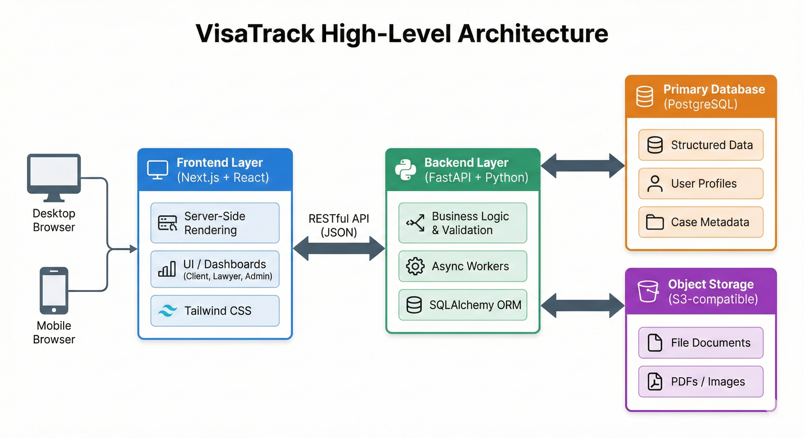

# Project Overview: VisaTrack

Course: SEG4910
Version: 1.0 (Initial) | Date: January 20, 2026

## 1. Project Outline

VisaTrack is a web-based client and case management system designed for immigration and visa-processing consulting firms. The platform centralizes client information, case documents, application status, and communication into a single secure system, replacing fragmented workflows that currently rely on email, spreadsheets, and manual follow-ups.

The system enables clients to track their visa application progress, upload required documents, receive reminders, and book follow-up appointments, while consultants gain access to an administrative dashboard for managing cases, storing files, and monitoring progress. The long-term goal of VisaTrack is to evolve into an extensible platform that adapts to changing immigration requirements and supports intelligent automation such as assisted form filling and document data extraction.

## Project Structure

- `frontend/` - Next.js web application
- `backend/` - FastAPI backend and database logic
- `docs/` - Architecture and design documentation
- `scripts/` - Development helper scripts

## 2. Team Members and Roles

Name | Role | Primary Responsibilities
--- | --- | ---
Umer Qamar | Full-Stack Developer | Adapting All Software Engineering roles
Mayoor | Full-Stack Developer | Doing Full-Stack things
Patrick Bonini | Full-Stack Developer | Adapting All Software Engineering roles
Pavel Karmaker | Full-Stack Developer | Adapting All Software Engineering roles
Ronit Mehta | Full-Stack Developer | Adapting All Software Engineering roles

## 3. Objectives

### 3.1 Benefit to Customer

Who is the end-user? How does this software make their life better or solve a specific pain point?

End users:

- Immigration consultants and visa-processing firms
- Clients applying for visas or immigration services

VisaTrack reduces administrative overhead for consultants by centralizing client data, documents, and application tracking. For clients, it improves transparency and communication by providing real-time status updates, clear document requirements, and structured follow-ups. This minimizes delays, reduces errors, and improves overall client experience.

### 3.2 Key Accomplishments

List the primary features or milestones that must be completed.

The primary goals of the project include:

- Secure user authentication for consultants and clients
- Client profile and case management
- Document upload and storage per case
- Application status tracking and progress indicators
- Consultant administrative dashboard
- Automated reminders and notifications
- Appointment scheduling functionality
- (Stretch goal) Intelligent document parsing and assisted form filling

### 3.3 Criteria for Success

What defines a "finished" and "successful" project? (e.g., "The app handles 100 concurrent users" or "The algorithm achieves 90% accuracy").

The project will be considered successful if:

- Core workflows (client onboarding, document upload, case tracking) function end-to-end
- The system supports multiple concurrent users without data corruption
- All sensitive data is stored securely and access-controlled
- The MVP is deployable and usable by a small consulting firm
- Codebase is maintainable, documented, and extensible for future work

## 4. Expected / Anticipated Architecture

Describe the high-level technical stack (e.g., MERN stack, AWS, Microservices). You should include a placeholder for a diagram here.

VisaTrack will follow a modular, web-based architecture with clear separation of concerns.

Frontend:

- React (with modern routing and component architecture)
- Tailwind CSS for styling

Backend:

- Node.js with Express (RESTful API)
- Authentication and authorization middleware

Database:

- PostgreSQL (relational data for users, cases, documents)

Hosting / Infrastructure:

- Cloud hosting (to be finalized)
- GitHub Actions for CI/CD

Architecture Diagram:

*The diagram above illustrates the interaction between the Next.js frontend,
FastAPI backend, and our data persistence layers (PostgreSQL & S3).*

## 5. Anticipated Risks

### 5.1 Engineering Challenges

What technical hurdles do you expect? (e.g., Learning a new API, data synchronization issues).

Security and Compliance:

- Especially dealing with sensitive user data, we need to implement robust encryption for immigration documents (at rest and in transit)
- Meeting data privacy regulations (GDPR, CCPA, or any Canadian-laws (isolated to Canada for now?)) for handling personal identification documents
- Building secure authentication with role-based access controls to separate client and consultant views

Intelligent Form-Filling Module:

- One idea we’ve had from the onset is to use some automation to help users fill out applications. In order to do so, we need to train and fine-tune models to accurately extract structured data from varied document formats (passports, birth certificates, employment letters, university degrees)
- Mapping extracted data to correct fields across different form types and handling form version changes

Data Management:

- Designing a flexible database schema that can accommodate changing immigration requirements across multiple countries
- Manage document versioning and audit trails (keep track of documents and changes to uploaded documents)

### 5.2 Mitigation Strategies

How will you handle these risks if they occur?

- Apply industry best practices for authentication, encryption, and access control
- Incremental development with frequent testing
- Start with a minimal, extensible schema and refactor as needed
- Treat intelligent automation as an optional enhancement, not a core dependency

## 6. Legal and Social Issues

### Privacy & Security

- User data will be encrypted in transit and access-controlled
- Only authorized users can view specific case data
- No unnecessary personal data will be collected

### Licensing

The project will use the MIT License to allow flexibility and future expansion

### Social Impact

The system aims to improve accessibility and transparency for users navigating complex immigration processes
UI design will consider clarity and usability for non-technical users

## 7. Initial Plans

### 7.1 Tool Setup

Version Control: GitHub
Project Management: GitHub Issues & GitHub Projects
Documentation: README.md and GitHub Wiki (if needed)
Communication: Team

### 7.2 First Release Plan

Describe the "MVP" (Minimum Viable Product). What will be functional by the first milestone?

The first release will focus on a functional Minimum Viable Product (MVP):

- User authentication (client & consultant)
- Basic client profile creation
- Case creation and status tracking
- Document upload and storage
- Consultant dashboard for managing cases

This MVP establishes the foundation for future iterations and advanced features.
